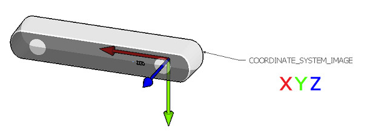

# ZED X One Stereo Calibration

This sample show how to calibrate 2 ZED X one in stereo configuration to be able to use it in the ZED SDK.

A calibration pattern is required, the bigger, the better. As a starting point a small printed chessboard (A4) can be used, make sure it's flat and that the dimension and characteristics are correctly [entered in the code](https://github.com/stereolabs/zedx-one-capture/blob/6c5254b728c5f683db373a1f4d66abead930b27f/stereo_calibration/main.cpp#L13-L15).

Other chessboard can be generated using OpenCV scripts https://docs.opencv.org/4.x/da/d0d/tutorial_camera_calibration_pattern.html

The calibration process uses images saved manually with the chessboard visible and at different position each time in the image.

When calibrating, make sure the calibration pattern is seen in all the field of view of the camera along the process.

The chessboard should be tilted along each axis at different distances, the GUI indicates which axis should be further excited.

Once enough images are saved the calibration process will run and output a conf file readable by the SDK. It should be renamed using the virtual serial number chosen, see https://www.stereolabs.com/docs/get-started-with-zed-x-one/zed-x-one-stereo/ for more information.
